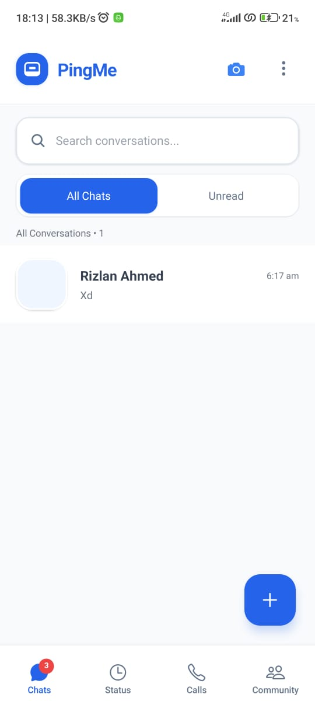

# PingMe - Fullstack Real-time Chat Application

[](https://reactnative.dev/) 
[](https://nodejs.org/) 
[](https://www.mysql.com/) 
[](https://socket.io/)

---

## 🧩 Project Overview
PingMe is a full-stack real-time chat application built using modern web technologies for seamless communication between users.  
It provides instant messaging, typing indicators, message status tracking, and online/offline status.

---

## ⚙️ Tech Stack

- **Frontend:** React Native, TypeScript, Expo, Socket.io Client  
- **Backend:** Node.js, Express.js, Socket.io, REST APIs  
- **Database:** MySQL (via Workbench / HeidiSQL)  
- **Real-time Communication:** WebSocket connections  
- **IDE:** VS Code (frontend & backend)

---

## 📂 Project Structure

- **frontend/** → React Native project with TypeScript components  
- **backend/** → Node.js server with Express and Socket.io  
- **database/** → SQL files for database schema and tables  
- **config/** → Configuration files for database and environment variables  
- **screenshots/** → App screenshots for reference


---

---

## 🛠️ Setup Instructions

### 1️⃣ Database Setup

1. Open **MySQL Workbench** or **HeidiSQL**  
2. Import `database/pingme_schema.sql` to create all tables  
3. Update the database configuration in `backend/config/database.js`:

```javascript
{
  host: 'localhost',
  user: 'your_db_username',
  password: 'your_db_password',
  database: 'pingme'
}
```
---

2️⃣ **Backend Setup**

Navigate to the backend directory:
cd backend
npm install
npm start

The server runs on http://localhost:3001

---

3️⃣ **Frontend Setup**

Navigate to the frontend directory:

cd frontend
npm install

Update API configuration in src/config/api.ts:

export const API_BASE_URL = "http://localhost:3001/api";
export const SOCKET_URL = "http://localhost:3001";

Run the application:

# iOS
npx react-native run-ios

# Android
npx react-native run-android

---

### 3. Screenshots

**Splash Screen**  
  


**Single Chat**  
  

**Sign In**  
  

**Profile Page**  
  

**HomeChat Page**  
  

**Status Page**  
  

---


🔄 **Real-time Features**

- Instant message delivery
- Online/offline status
- Message status tracking:
  ✓ Sent
  ✓✓ Delivered
  ✓✓ Blue = Read
- Typing indicators
- Contact synchronization

📦 **Dependencies**

**Frontend Packages**
- React Native
- TypeScript
- Socket.io Client
- Expo Vector Icons
- React Navigation

**Backend Packages**
- Node.js & Express
- Socket.io
- MySQL2
- CORS
- Body Parser

💡 **Note:** Run `npm install` in both frontend and backend directories before starting the project.

🚀 **Deployment Notes**
- Use ngrok for testing mobile connection with local backend
- Export .war file in NetBeans for Tomcat deployment (backend)
- Bundle frontend with Expo or React Native CLI


